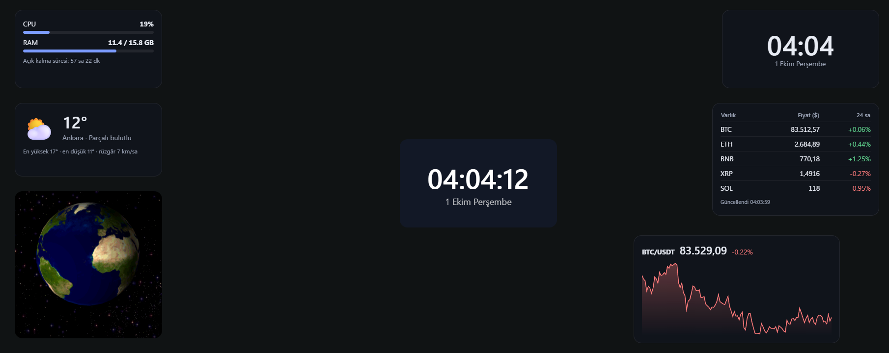
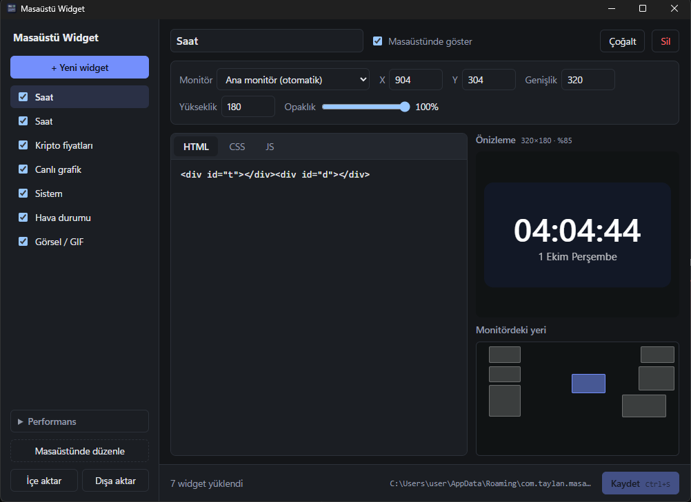

# Masaüstü Widget

Windows masaüstüne, **duvar kağıdı katmanına (ikonların arkasına)** gömülen canlı widget'lar. Her widget serbest HTML/CSS/JS: canlı borsa grafiği, tablo, GIF, sistem bilgisi... ne istersen. Widget'lar tıklama almaz, arka planın bir parçası gibi durur. Görünmedikleri anda kendiliğinden donar, yani pil ve işlemci dostudur.



## Özellikler

- **Masaüstüne gömülü:** İkonların arkasında durur, tıklamalar ikonlara gider. Explorer çökse de kendini yeniden gömer.
- **Serbest içerik:** Her widget yalıtılmış bir iframe'de çalışan HTML/CSS/JS'ten oluşur. Hazır şablonlar: saat, görsel/GIF, kripto fiyat tablosu, canlı grafik, sistem bilgisi, hava durumu.
- **Görsel düzenleme:** Widget'ları masaüstünde sürükleyip boyutlandırabilirsin (8 px ızgara, ok tuşlarıyla ince ayar).
- **Az kaynak:** Kurulum ~2 MB. Tek saat widget'ıyla boştayken CPU ~%0,04, bellek ~105 MB (WebView2 dahil). Büyütülmüş ya da tam ekran bir pencere monitörü kapladığında o monitördeki widget'lar donar; kilit ekranında hepsi donar.
- **Çoklu monitör:** Her widget bir monitöre atanır.
- **Açılışta başlar:** Sistem tepsisinde yaşar, ilk kurulumda başlangıca eklenir.
- **İçe/dışa aktarma:** Widget'ları JSON olarak paylaşabilirsin.

## Kurulum (Windows 10/11)

1. [Releases](../../releases/latest) sayfasından birini indir:
   - `Masaüstü.Widget_x.y.z_x64-setup.exe`: önerilen. Yönetici izni istemez, kullanıcı klasörüne kurulur.
   - `Masaüstü.Widget_x.y.z_x64_en-US.msi`: kurumsal dağıtım için.
2. Çalıştır. Uygulama imzasız olduğu için Windows SmartScreen "Windows bilgisayarınızı korudu" diyebilir: **Ek bilgi → Yine de çalıştır**.
3. İlk açılışta masaüstüne örnek bir saat gelir ve uygulama başlangıca eklenir.

Windows 11'de WebView2 hazır gelir. Windows 10'da yoksa kurulum dosyası onu kendisi indirir.

## Kullanım

Sistem tepsisindeki simgeye **sol tıklayınca** yönetim penceresi açılır (simge gizli simgeler `^` bölümünde olabilir, oradan görev çubuğuna sürükleyebilirsin). **Sağ tık** menüsü:

| Menü | Ne yapar |
|---|---|
| Aç | Yönetim penceresi: widget ekle, sil, kodunu düzenle, canlı önizle |
| Düzenleme modu | Widget'ları masaüstünde sürükle/boyutlandır. **Enter** kaydeder, **Esc** geri alır, **Alt** ızgarayı kapatır |
| Duraklat | Tüm widget'ları tamamen durdurur |
| Başlangıçta çalıştır | Windows açılışında otomatik başlatma |



Değişiklikler **Kaydet** (Ctrl+S) ile masaüstüne uygulanır. Performans ayarları yönetim penceresinin sol altında.

Komut satırından da kontrol edilebilir: `masaustu-widget.exe --pause` / `--resume` (zaten çalışan örneğe iletilir).

## Widget yazmak

Her widget'ın HTML, CSS ve JS alanı var. `body` widget'ın kendisidir; boyutu genişlik × yükseklik kadardır. Arka plan varsayılan olarak şeffaftır.

```html
<div id="price">…</div>
```

```js
// widget.fetch: istek uygulama üzerinden gider, CORS engeline takılmaz
const res = await widget.fetch("https://api.binance.com/api/v3/ticker/price?symbol=BTCUSDT");
price.textContent = res.json().price;
```

| API | Döner |
|---|---|
| `widget.fetch(url, { method, headers, body })` | `{ status, ok, headers, text, json() }`. Yalnızca http/https, en fazla 5 MB, 15 sn zaman aşımı |
| `widget.system()` | `{ cpu, mem_used_mb, mem_total_mb, mem_percent, uptime_s }` |

Bilmekte fayda var:

- Normal `fetch` ve `WebSocket` de çalışır. `fetch` yalnızca CORS izni veren adreslerde işe yarar; diğerleri için `widget.fetch` kullan.
- Widget'lar yalıtılmış (`sandbox="allow-scripts"`) çalışır: `localStorage`, çerezler ve açılır pencereler yoktur. Uygulamaya ya da diğer widget'lara erişemezler.
- CDN'den kütüphane yükleyebilirsin (`<script src="https://cdn.jsdelivr.net/...">`).
- Widget dondurulup uyandırıldığında sayfa yeniden yüklenmez. WebSocket bağlantısı koparsa yeniden bağlanmak widget'ın işidir; "Canlı grafik" şablonunda örneği var.

Ayarlar `%APPDATA%\com.taylan.masaustuwidget\widgets.json` dosyasında tutulur.

## Kaynaktan derleme

Gerekenler: [Rust](https://rustup.rs) (stable, MSVC), [Node.js](https://nodejs.org) 20+, [Tauri ön koşulları](https://tauri.app/start/prerequisites/) (Visual Studio C++ Build Tools).

```sh
npm install
npm run tauri dev      # geliştirme
npm run tauri build    # kurulum dosyaları: src-tauri/target/release/bundle/
cd src-tauri && cargo test --lib
```

Kod düzeni:

| Yol | İçerik |
|---|---|
| `src-tauri/src/desktop.rs` | WorkerW/Progman'a gömme, z-sırası, kaplanma/kilit/pil algılama (Win32) |
| `src-tauri/src/lib.rs` | Host pencereleri, tepsi, gözcü, otomatik dondurma, düzenleme modu |
| `src-tauri/src/bridge.rs` | `widget.fetch` ve `widget.system` |
| `src/host/` | Monitör başına gömülü sayfa: widget iframe'lerini dizer |
| `src/manager/` | Yönetim penceresi |
| `src/edit/` | Düzenleme katmanı |
| `src/templates.ts` | Hazır şablonlar |

### Yeni sürüm yayınlama

1. Sürümü üç yerde artır: `package.json`, `src-tauri/Cargo.toml`, `src-tauri/tauri.conf.json`.
2. `git tag v0.2.0 && git push --tags`.
3. GitHub Actions kurulum dosyalarını derleyip taslak bir Release oluşturur; kontrol edip yayınla.

## Bilinen sınırlar

- Yalnızca Windows.
- Çoklu monitör ve farklı DPI'lı monitör karışımı tek monitörlü makinede geliştirildi, gerçek çoklu monitörde denenmedi.
- Windows 10 (klasik WorkerW yapısı) için kod yolu var ama denenmedi.
- Bir widget'ı sürükleyerek başka monitöre taşıyamazsın; monitörü yönetim penceresinden seç.
- Ekran yalnızca kapandığında (kilitlenmeden) widget'lar donmaz.
- Kod imzası yok, SmartScreen uyarısı bu yüzden.

## Lisans

[MIT](LICENSE)

---

### English

**Masaüstü Widget** embeds live HTML/CSS/JS widgets into the Windows wallpaper layer, behind the desktop icons. Widgets are click-through, run in sandboxed iframes, and are suspended automatically when a maximized or fullscreen window covers their monitor, or when the session is locked. Built with Tauri 2 (Rust + WebView2); installer ~2 MB, ~0% CPU when idle.

Download the installer from [Releases](../../releases/latest). Left-click the tray icon to manage widgets, or right-click → *Düzenleme modu* to drag and resize them on the desktop. Widgets can call `widget.fetch()` (CORS-free HTTP through the app) and `widget.system()` (CPU/RAM). Build from source with `npm install && npm run tauri build`.
